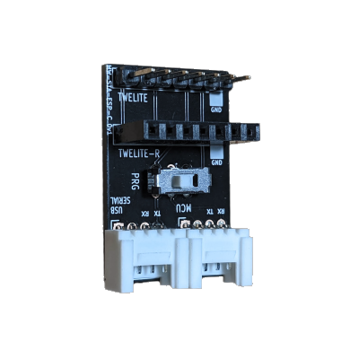
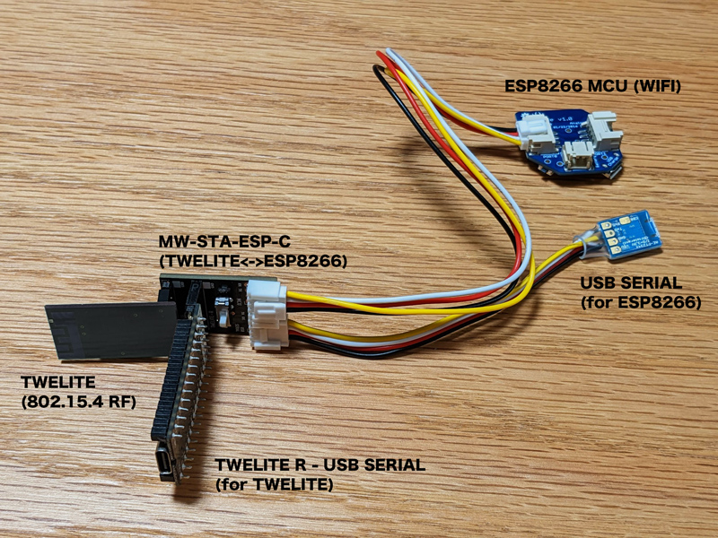
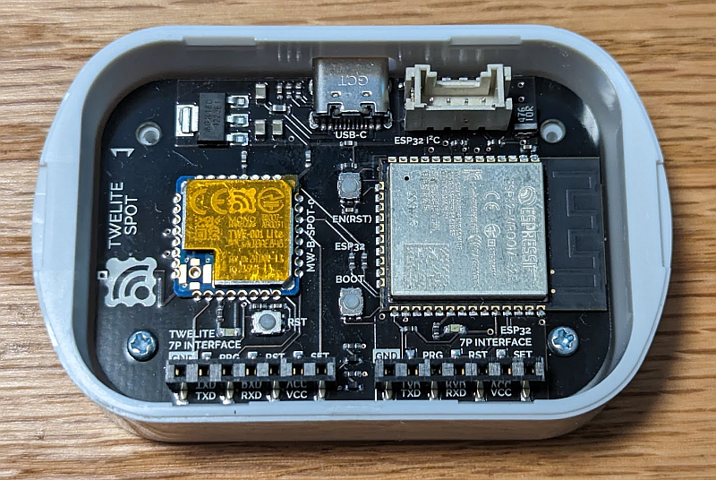

# MWings - Mono Wireless TWELITE Wings parser library

本ライブラリは、Mono Wireless TWELITE 無線モジュールが無線受信時に UART(シリアル) に出力する無線パケット情報を、他のマイコンで解釈するパーサーライブラリです。

## 準備

### 動作に必要なもの
* TWELITE無線モジュール
  - TWELITE DIPまたはPAL
  - App_Wings を書き込んでおく
  - 事前に TWELITE ARIA などの TWELITE 無線パケットを受信できることを確認しておく

* マイコン
  - ESP8266搭載のマイコンボード (WIONODE など)
  - ESP32搭載のマイコンボード (TWELITE SPOT など)

### TWELITE の動作確認
親機側には受信用のファームウェア App_Wings を書き込みます。また親機と子機は**同じ無線チャネル(使用する無線周波数)とアプリケーションID(同じチャネルでも別のネットワークとして識別される)**を指定します。

* 親機の設定
  1. [TWELITE STAGE APP-トワイライトステージアプリ](https://mono-wireless.com/jp/products/stage/stage-app.html)をインストールしておく
     https://stage.twelite.info/install
  2. TWELITE DIP（または TWELITE UART）を [TWELITE R](https://mono-wireless.com/jp/products/TWE-LITE-R/) に接続する。
  3. TWELITE STAGE アプリを起動する
      a. [シリアルポートの選択画面](https://stage.twelite.info/usage/screens/serial_port_sel)が起動時に表示されるので TWELITE R を選択します。
      b. [メインメニュー](https://stage.twelite.info/usage/screens/main_menu)より、[アプリ書き換え](https://stage.twelite.info/usage/screens/main_menu/firm_prog)、[BINから選択](https://stage.twelite.info/usage/screens/main_menu/firm_prog/bin)を開く。
      c. 一覧より App_Wings_??? (**MONOSTICKが含まれないもの**) を選択する。
      d. [書き換え](https://stage.twelite.info/usage/screens/main_menu/firm_prog/build_screen)が行われます。
  4. インタラクティブモードでの無線設定を行います。<br />
      STAGE アプリのメインメニューからインタラクティブモードを選択します。チャネル(channel)とアプリケーションID(AppID)の設定が必要になる場合があります。

* 子機の設定
  1. TWELITE CUEなど子機を TWELITE R に接続します。
  2. インタラクティブモードでの無線設定を行います。<br />
     親機の設定と同じチャネル(channel)とアプリケーションID(AppID)を設定します。
  
### 無線モジュールとマイコンの接続

無線モジュールとマイコン(ESP8266, ESP32)の接続には、シリアル(UART)同士を接続(クロス接続)します。シリアルのGROVE端子付きのマイコンとの接続を容易にする MW-STA-ESP-C 基板（後述）もあります。


ESP8266 の場合 (Serial)
```TEXT
   ESP8266 GPIO1(TX) --- TWELITE RxD0(DIO7: DIP  #3), RxD1(DIO15: DIP #19)
           GPIO3(RX) ---         TxD0(DIO6: DIP #10), TXD1(DIO14: DIP #2)
                 GND --- GND
                 VCC --- VCC
```

ESP32 の場合　(Serial2 に接続を推奨します)
```TEXT
    ESP32 GPIO17(TX) --- TWELITE RXD(DIO7: DIP  #3), RxD1(DIO15: DIP #19)
          GPIO16(RX) ---         TXD(DIO6: DIP #10), TXD1(DIO14: DIP #2)
                 GND --- GND
                 VCC --- VCC
```

* HardwareSerial が利用できるポートに接続します。
* GND の接続を忘れないようにしてください。
* VCC は上記では同一としています。
* TWELITE は UART1(DIO14,15) も接続可能です。UART1 出力できるTWELITE のファームウェアが必要です。


### 無線モジュールとマイコンの接続(MW-STA-ESP-C 基板での接続)




MW-STA-ESP-C 基板では　TWELITE UART と GROVE 経由での外部マイコン(ESP8266 利用マイコンなど)への接続を行います。スイッチによりマイコンとの接続状態を、TWELITEとの直結状態またはプログラム書き込み用接続に切り替えられます。



```TEXT
                   
  [TWELITE-UART]==o====o==[GRV 4P:MCU(外部マイコン)]
                  | SW |
     [TWELITE-R]==o    o==[GRV 4P:USB SERIAL]
 
■ SW が OP. 位置 (運用モード。TWELITE-UARTとGROVE:MCUが相互通信)
  [TWELITE-UART]          [GRV 4P:MCU(外部マイコン)]      [GRV 4P:USB SERIAL] 
      UART0 RxD ----------- Serial TxD GPIO1 -------------- RxD (モニター用)
      UART0 TxD ----------- Serial RxD GPIO3                TxD (未接続)
             |
[TWELITE-R] RxD*1 (モニター用:TWELITE-UARTからの出力のみ接続)
            TxD*1 (未接続)

■ SW が PRG 位置 (プログラム書き込みモード)
  [TWELITE-UART]           [TWELITE R]
      UART0 TxD ------------- RxD*1
      UART0 RxD ------------- TxD*1
     
  [GROVE:MCU(外部マイコン)]  [GROVE:USB SERIAL]
      Serial TxD GPIO1 ------ RxD
      Serial RxD GPIO3 ------ TxD
     
*1 TWELITE R の基板上の表示は TWELITE UART の信号名になっています。上記のRxDは基板上TxD表示、TxDは基板上RxD表示です。
```

SW状態により、以下の2状態で運用できます。
* OP. 運用モード<br />運用モードは、`[TWELITE-UART]` と `[GROVE:MCU(外部マイコン)]` が相互に通信します。`[TWELITE-UART]`からのメッセージは`[GROVE(が言う部マイコン)]`に伝えられ、逆方向も同様です。
  * `[TWELITE R]`は`[TWELITE UART]`の出力TxDをモニターできます。同様に`[GRV 4P:USB SERIAL]`により`[GRV 4P:MCU(外部マイコン)]`の出力TxDをモニターできます。各々入力RxDは未接続です。

* PRG. プログラム書き込みモード<br />プログラム書き込みモードでは、`TWELITE-UART` と`[GRV 4P:MCU(外部マイコン)]`は接続せず、各々`[TWELITE-R]`と`[GROVE:USB SERIAL]`に接続し、各々のプログラム書き込みや設定などを行います。


TWELITEへの電源は `[GRV 4P:MCU(外部マイコン)]` 端子の2番ピンの電源ラインから供給されます。
* 2.3Vから3.6Vを供給します。**5Vを供給してはいけません。**
* WioNodeでは3.3Vを供給します。**ただしIO15を出力HIGHに設定しないと電源供給されません。**<br />
  `pinMode(15, OUTPUT); digitalWrite(15, HIGH);`

`[TWELITE UART]`には、`App_UART`というシリアル通信に特化したファームウェアが書き込まれています。`App_Wings`を書き込む必要があります。


### TWELITE SPOTを用いた接続

TWELITE SPOTは ESP32 と TWELITE BLUE が一つの基板に搭載されています。



```
■ TWELITE SPOT 構成

[TWELITE BLUE]                [ESP32]
   TxD1 DIO14 ----------------- Serial2 RxD GPIO16
   RxD1 DIO15 ----------------- Serial2 TxD GPIO17
   RESETN     ----------------- GPIO5
   PGM        ----------------- GPIO4
   TxD0,RxD0                    Serial0(TxD0,RxD0)
    ||                           ||
  [7P:TWELITE R]                [7P:TWELITE R]

[GROVE]                       [ESP32]
  #1 -------------------------- GPIO22 (SCL利用を想定,10Kでプルアップ) 
  #2 -------------------------- GPIO21 (SDA利用を想定,10Kでプルアップ)
  #3 -- 3V3
  #4 -- GND
```


以下の点に注意が必要です。

* **TWELITEを動作させるためには、ESP32側で GPIO5, GPIO6 端子を出力に設定する必要（通常稼働時は双方HIGHに設定）があります。**
* TWELITE の書き換えには、TWELITE 7P INTERFACE 側に TWELITE R を接続します。TWELITE のファームウェアの書き換えや設定には TWELITE STAGE アプリを利用します。
* EPS32の書き換えにも TWELITE R を用います。ESP32 7P INTERFACRE 側に TWELITE R を差し込みます。ただし、ESP32の開発ツールからプログラムモードに自動設定は出来ません。プログラムモードに遷移するにはBOOTボタンを押しながら EN(EST)ボタンを押します。
* TWELITE と ESP32 のファームウェアを同時に開発する場合は、TWELITE R を２台用意すると便利です。
* ESP32のファームウェアから、TWELITEのファームウェアを書き込むことは出来ません。


## ライブラリの利用

### ライブラリの登録
Arduino IDE のライブラリの登録を行います。通常のインストールでは、ライブラリは`[ドキュメントフォルダ]`にある`Arduino/libraries`に格納されます。本フォルダ以下をライブラリフォルダ直下にコピーします。

ここでは、フォルダ名をMWingsとしてコピーします。
```TEXT
[ドキュメントフォルダ]
  /Arduino
    /libraries
	  /MWings
	    doc/
		examples/
		src/
		readme.md
		...
```


同様に MWutls ライブラリをコピーしておきます。MWutls ライブラリは、MWings ライブラリの動作には直接必要ではありませんが、サンプルコードなどで利用するため、インストールしておきます。

```
[ドキュメントフォルダ]
  /Arduino
    /libraries
	  /MWings  <--- 本ライブラリ
	  /MWutls  <--- サポートライブラリ (FIFOコンテナやprintf処理など)
	  
※ フォルダ名の大文字小文字は気にしません。
```


### スケッチの記述

#### 宣言部

```
// for TWELITE
#include <MWings.h> // TWELITE Wings シリアルパーサー (new!)
#include <MWutls.h> // ユーティリティ (WSer, format()他) ※ 必須ではありません

// MWings クラスオブジェクト
MWings twelite;
```


#### setup()

以下の処理を行います。

1. シリアル通信 (`Serial`または`Serial2`)の初期化を行う。
2. MWingsの初期化を行う。`twelite.setup()` に`Serial`または`Serial2`を指定して呼び出す。
3. データの入力があったときの処理関数を指定する。`twelite.on()`に処理(ラムダ式)を指定して呼び出す。
4. 接続先のTWELITEを起動する(電源を投入する)


シリアルポートの初期化を行います。TWELITE 無線モジュールと接続されいてるシリアルポートを初期化します。

```C++
// Serial を用いる場合 (ESP8266)
Serial.setRxBufferSize(512); // 十分な大きさの UART 受信バッファを用意する
Serial.begin(115200);
```

```C++
// Seiral2 を用いる場合 (ESP32)
Serial2.setRxBufferSize(512); // 十分な大きさの UART 受信バッファを用意する
Serial2.begin(115200);
```


MW-STA-ESP-C 基板と WIONODE の組み合わせでは、GROVE端子に電源供給をするための制御が必要です。

```C++
// setup() の冒頭
pinMode(15, OUTPUT);
digitalWrite(15, LOW); // GROVE 端子に電源供給しない（TWELITE が動作しない)

// setup() の末尾
digitalWrite(15, HIGH); // GROVE 端子に電源供給する（TWELITE が動作する)
```


MWings の初期化を行います。初期化のパラメータには、TWELITE が接続されているシリアルポートのクラスオブジェクト(`HartwareSerial`)を指定します。シリアルポートの読み書き処理を `MWings` ライブラリ中で行うための指定です。また TWELITE SPOT では、TWELITE 側のPGM,RSTピンの制御が必要になるため、２番目と３番目の引数に 5 と 4 を指定します。

```C++
// Serial の場合 (MW-STA-ESP-C基板+ESP8266)
twelite.setup(Serial); 
```

```C++
// Serial2 の場合 (TWELITE SPOT)
twelite.setup(Serial2, 5 /* RST */, 4 /* PGM */); 
```


続いて、TWELITE からのパケットデータが得られた場合に呼び出される処理関数を登録します。この関数は事前に定義しておく必要があり、このようにライブラリ内から条件が成立したときに呼び出される関数をコールバック関数と呼びます。

以下の例では TWELITE ARIA (温湿度センサー付き)からのデータが得られた場合にコールバック関数`on_pkt_ARIA()` が呼び出されるように指定します。指定は `twelite.on()` で行います。パラメータにはラムダ式が使用でき、直接処理を記述することも可能ですが、以下の例では `on_pkt_ARIA()` 関数を呼び出すように記述しています。

また、複数のパケットの処理を指定する場合は、コールバック関数をパケットの種類ごとに作成して登録します。

```C++
// プロトタイプ宣言（.inoファイルでは省略できる場合がありますが、ここでは明示的に記述しています）
void on_pkt_ARIA(ParsedAriaPacket &);

// TWELITE ARIA の処理関数を設定します。
twelite.on([](const ParsedAriaPacket& packet){ on_pkt_ARIA(packet); });

//そのほかのコールバック関数の登録
// PAL_AMB の処理関数
//   twelite.on([](const ParsedPalAmbPacket& packet){ on_pkt_PAL_AMB(packet); });
// CUE(デフォルト設定) の処理関数
//   twelite.on([](const ParsedCuePacket& packet){ on_pkt_CUE(packet); });
// PAL_MOT,CUE(MOT設定) の処理関数
//   twelite.on([](const ParsedPalMotPacket& packet){ on_pkt_PAL_MOT(packet); });
```


最後に `twelite.begin()` を呼び出します。パラメータにはチャネル番号とTWELITEのアプリケーションID(無線パケットのアプリケーションを識別するための番号、同じ無線チャネルを使っても複数の無線アプリケーションを混信せず利用する)を指定します。

```C++
twelite.begin(18, 0x67720102);      // 周波数チャネル・アプリケーションIDの設定
```

※ チャネル・アプリケーションIDの設定は、マイコン間通信による設定対応の TWELITE Wings アプリを書き込んでおく必要があります。設定対応がない Wings アプリが TWELITE に書き込まれている場合は TWELITE に対して直接設定を行う必要があります。


#### loop()

loop()関数内では `twelite.update();` を呼び出します。この処理内ではシリアルポートからのデータを読み出し、逐次データを解釈します。一連のデータが無線パケットのデータとして完結した場合、パケットの種別に対応した登録済みのコールバック関数を呼び出します。

```C++
void loop() {
    twelite.update();
}
```


#### コールバック関数 - on_pkt_ARIA()

TWELITE ARIA 用のコールバック関数の例を示します。

```C++
void on_pkt_ARIA(const ParsedAriaPacket &d)
{
	// パケットの内容を表示する（確認用）
	Serial.print("PKT/ARIA: ");

   	Serial.print("T=");
	Serial.print(float(d.i16Temp) / 100.0); // 温度は符号付100倍値。100で割ると℃。
	Serial.print("C ");

	Serial.print("H=");
	Serial.print(float(d.u16Humid) / 100.0); // 湿度は符号なしの100倍値。100で割ると%。
	Serial.print("%");
    
    Serial.println("");
}
```

コールバック関数の引数は `tsMWings_App_ARIA`構造体の参照型(`&`付きのC++特有の記述)です。この構造体はコールバック関数が呼び出されている間のみ読みだすことができます。関数脱出後には参照は許されません。


## リファレンス(構造体)

コールバック関数の引数として利用される構造体について解説します。構造体はパケット種別ごとに定義されています。構造体種別間で共通に持っているメンバーは「共通」で紹介しています。


### 共通

パケット種別ごとの定義される構造体間で共通のメンバーについて紹介します。

| メンバー          | 型         | 解説                                                         |
| ----------------- | ---------- | ------------------------------------------------------------ |
| u32SourceSerialId | `uint32_t` | 送信元の32bitシリアル番号（TWELITEモジュール製造時に割り振られる番号） |
| u16SequenceNumber | `uint16_t` | 送信ごとの続き番号（シーケンス番号。特に注記がない場合は、0から始まり最大値は65535、0に戻ります） |
| u8SourceLogicalId | `uint8_t`  | 送信元の論理デバイスID（送信元で割り振っている番号、異なるTWELITE無縁モジュールに同じ番号を割り振ることも可能） |
| u8Lqi             | `uint8_t`  | 受信時の信号の強さ（送信側がより強い出力である、アンテナが近いなど、より強い信号を受信した場合、より大きな値になる） |
| u16SupplyVoltage  | `uint16_t` | 送信元の電源電圧（送信元が計測している場合のみ有意な値が     |

* 一部のメンバーが定義されない場合もあります。


### tsMWings_App_ARIA

TWELITE ARIA のパケット情報です。温度・湿度センサーおよび磁気センサーの値が含まれます。

| メンバー            | 型         | 解説                                                         |
| ------------------- | ---------- | ------------------------------------------------------------ |
| i16Temp100x         | `int16_t`  | 温度（摂氏）を１００倍した値です。例えば`1234`の値の場合は12.34℃です。 |
| u16Humid100x        | `uint16_t` | 湿度（％）を１００倍した値です。例えば`5678`の値の場合は56.78%です。 |
| u8MagnetState       | `uint8_t`  | `0`,`1`,`2`の値をとります。`0`はセンサーの近くに磁石がない、`1`はセンサーの近くにN極、`2`はセンサーの近くにS局があることを示します。 |
| bMagnetStateChanged | `bool_t`   | `TRUE`(1)の場合、センサーの値が変化したことを示します。`FALSE`(0)の場合、センサーの値に変化がなかったことを示します。例えば磁石が近づいて値が1になったときは u8MagnetStateが`1`、bMagnetStateChangedが`TRUE`になります。 |


### tsMWings_App_PAL_AMB

TWELITE PAL AMB (環境センサーPAL) のパケット情報です。温度・湿度・照度センサーの値が含まれます。

| メンバー     | 型         | 解説                                                         |
| ------------ | ---------- | ------------------------------------------------------------ |
| i16Temp100x  | `int16_t`  | 温度（摂氏）を１００倍した値です。例えば`1234`の値の場合は12.34℃です。 |
| u16Humid100x | `uint16_t` | 湿度（％）を１００倍した値です。例えば`5678`の値の場合は56.78%です。 |
| u32Luminance | `uint32_t` | 照度センサーの値[ルックス]です。                             |


### tsMWings_App_CUE

TWELITE CUE の標準設定のパケットです。１０サンプルの加速度情報とともに、磁気センサーの値、加速度情報に基づくイベント情報が含まれます。

| メンバー                                          | 型        | 解説                                                         |
| ------------------------------------------------- | --------- | ------------------------------------------------------------ |
| u8SampleCount                                     | `uint8_t` | パケットに含まれるサンプル数で `10` 固定です。               |
| i16SamplesX[10], i16SamplesY[10], i16SamplesZ[10] | `int16_t` | X, Y, Z ３軸の加速度値で、単位は mG [ミリG] つまり 1000mG が 1G です。 |
| u8MagnetState                                     | `uint8_t` | `0`,`1`,`2`の値をとります。`0`はセンサーの近くに磁石がない、`1`はセンサーの近くにN極、`2`はセンサーの近くにS局があることを示します。 |
| bMagnetStateChanged                               | `bool`    | `TRUE`(1)の場合、センサーの値が変化したことを示します。`FALSE`(0)の場合、センサーの値に変化がなかったことを示します。例えば磁石が近づいて値が1になったときは u8MagnetStateが`1`、bMagnetStateChangedが`TRUE`になります。 |
| bHasAccelEvent                                    | `bool`    | イベント情報が含まれる場合は `TRUE`(1) になります。イベント情報は `u8Event` を参照します。 |
| u8AccelEvent                                      | `uint8_t` | イベント情報です。<br />- 0x01(1)～0x06(6)：さいころ <br />- 0x08(8)：シェイク <br />- 0x10(16)：ムーブ |


### tsMWings_App_PAL_MOT

TWELITE PAL MOT (加速度センサーPAL) または TWELITE CUE の MOT モードにした場合に得られるパケットです。連続的なサンプルを行いたい場合などに利用します。

| メンバー                                          | 型        | 解説                                                         |
| ------------------------------------------------- | --------- | ------------------------------------------------------------ |
| u8SampleCount                                     | `uint8_t` | パケットに含まれるサンプル数で `16` 固定です。               |
| i16SamplesX[16], i16SamplesY[16], i16SamplesZ[16] | `int16_t` | X, Y, Z ３軸の加速度値で、単位は mG [ミリG] つまり 1000mG が 1G です。 |